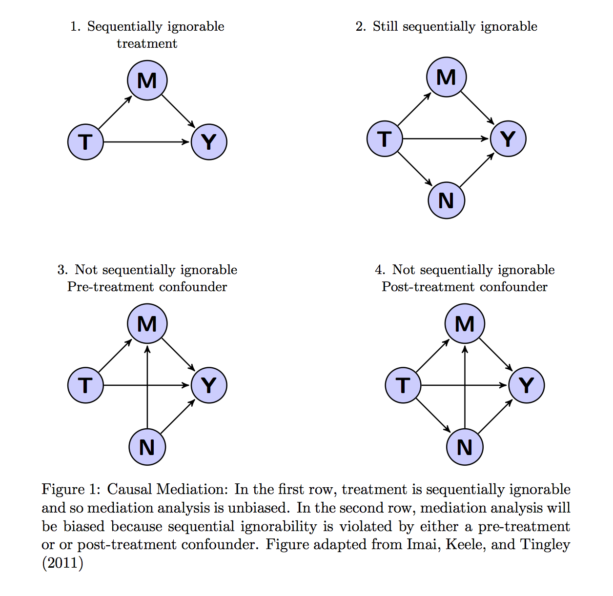

\DeclareMathOperator*{\E}{\mathbb{E}}
\newcommand{\ci}{\mathrel{\text{$\perp\mkern-10mu\perp$}}}
\newcommand{\bx}{\mathbf{x}}
\newcommand{\bX}{\mathbf{X}}
\newcommand{\bbeta}{\boldsymbol{\beta}}


```{r,echo=FALSE,results='hide'}
options(tikzDefaultEngine='xetex',
	digits=3)
knitr::set_header(tikz = "\\usepackage{tikz}")
knitr::opts_chunk$set(message=F,warning=F,eval=T,results='markup',cache=T, strip.white=TRUE, comment=NA)

```


# Causal Claims, Counterfactuals, and Average Treatment Effects

Causal claims involve subjunctive statements. The causal effect of auditing on municipal corruption for a given city is the comparison of the corruption measured in that city after auditing occurred at time $t$ with the corruption that would have been measured in that city had auditing not occurred at time $t$. Since we observe only one of these two potential outcomes (corruption with auditing versus corruption without auditing), we cannot know the causal effect of auditing on an individual municipality. However, @neyman1990application showed that if we randomized auditing across a sample of municipalities we can produce estimates of and draw inferences about the average over the causal effects of auditing in our sample.

The average causal effect or average treatment effect (ATE) is a powerful concept because it is one solution to the problem of not observing all relevant counterfactuals. Yet, it is not the only productive engagement with this problem. In fact, there are many different types of quantities of causal interest. The goal of this guide is to help you choose estimands (a parameter of interest) and estimators (procedures for calculating estimates of those parameters) that are appropriate and meaningful for your data.

We begin by showing how, with randomization, a simple difference-of-means provides an unbiased estimate of the ATE. We take extra time to introduce some common statistical concepts and notation used throughout this guide.

First we define a treatment effect for an individual observation (a person, household, city, etc.) as the difference between that unit's behavior under treatment ($Y_i(1)$) and control  ($Y_i(0)$) :

$$
\tau_i=Y_i(1)-Y_i(0)
$$

Since we can only observe either $Y_i(1)$ or $Y_i(0)$ the individual treatment effect is unknowable. Now let $D_i$ be an indicator for whether we observe an observation under treatment or control. If treatment is randomly assigned, $D_i$ is independent, not only of potential outcomes but also of any covariates (observed and unobserved) that might predict also those outcomes ($(Y_i(1),Y_i(0),X_i \ci D_i)$).^[See @holland1986statistics and  @angrist2008mostly for more formal discussion of independence and the assumptions necessary to estimate causal effects.]

Suppose our design involves $m$  units  under treatment  and $N-m$ under control.  Suppose we were to repeatedly reassign treatment at random many times and each time calculate the difference of means between treated and control groups and then to record this value in a list. The average of the values in that list will be the same as the difference of the means of the true potential outcomes had we observed the full schedule of potential outcomes for all observations.^[That is $\E(Y_i(1)\mid D=1)=\E(Y_i(1)\mid D=0)=\E(Y_i(1))$ and $\E(Y_i(0)\mid D=1)=\E(Y_i(0)\mid D=0)=\E(Y_i(0))$)]. Another way to say this characteristic of the average treatment effect and the estimator of it, is to say that the difference of observed means is an unbiased estimator of the average causal treatment effect.

$$
 ATE \equiv (1/N) \sum_{i=1}^N \tau_i = \frac{\sum_{1}^{N} Y_i(1)}{N} - \frac{\sum_{1}^{N} Y_i(0)}{N}
$$

And we often estimate the ATE using the observed difference in means:^[Estimates are often written with a hat, ($\widehat{ATE}$) to reflect the difference between the estimate from our particular sample and the estimand, of target of our estimation that is unobserved. Unless otherwise stated, in this guide we focus on generating sample estimates and subsequently omit this explicit notation for brevity. See @gerber2012field for concise introduction to this distinction and @imbens2007s for a thorough treatment of these concepts.]

$$
          \widehat{ATE} = \frac{\sum_{1}^{m} Z_i Y_i }{m} - \frac{\sum_{m+1}^{N} (1-Z_i) Y_i }{N-m}
$$

Statistical inference about the estimated ATE requires that we know how it will vary across randomizations. It turns out that we can write the variance of the ATE across randomizations as follows:

$$
  \begin{alignat}{1}
    V(ATE) &= \frac{N}{N-1}\left[\frac{V(Y_i(1))}{m} + \frac{V(Y_i(0))}{N-m} \right]-
    \frac{1}{N-1}\left[V(Y_i(1))+V(Y_i(0))-2*Cov(Y_i(1),Y_i(0))\right]\\
  \end{alignat}
$$

and estimate this quantity from the sample estimates of the variance in each group.^[The covariance of $Y_i(1),Y_i(0)$ is impossible to observe but the "Neyman" estimator of the variance omitting the covariance term provides a conservative (too large) estimate of the true sample variance because we tend to assume that the covariance is positive. Since we are generally worried about minimizing type I error rate (incorrectly rejecting true null hypothesis), we prefer using conservative estimates of the variance. See also @dunning2010design and @gerber2012field for justification of the conservative variance estimator.]

A linear model regressing the observed outcome $Y_i$ on a treatment indicator $D_i$ provides a convenient estimator of the ATE (and with some additional adjustments, the variance of the ATE):

$$
Y_i=Y_i(0)*(1-D_i)+Y_i(1)*D_i= \beta_0 +\beta_1 D_i + u
$$

since we can rearrange terms so that $\beta_0$ estimates the average among control observations ($Y_i(0)\mid D=0$) and  $\beta_1$ estimates the differences of means  ($Y_i(1)\mid D=1) - (Y_i(1)\mid D=0$).  In the code below, we create a sample of 1,000 observations and randomly assign a treatment $D$ with a constant unit effect to half of the units. We estimate the ATE using ordinary least squares (OLS) regression to calculate the observed mean difference. Calculating the means in each group and taking their difference would also produce an unbiased estimate of the ATE. Note that the estimated ATE from OLS is unbiased, but the errors in this linear model are assumed to be independent and identically distributed. When our treatment effects both the average value of the outcome and the distribution of responses, this assumption no longer holds and we need to adjust the standard errors from OLS using a Huber-White sandwich estimator to obtain the correct estimates (based on the variance of the ATE)  for  statistical inference [@lin2013agnostic]. Finally, we also demonstrate the unbiasedness of these estimators through simulation.

```{r ATEstuff, cache=TRUE, results='markup'}
set.seed(1234)              # For replication
N  = 1000                   # Population size
Y0 = runif(N)               # Potential outcome under control condition
Y1 = Y0 + 1                 # Potential outcome under treatment condition
D = sample((1:N)%%2)        # Treatment: 1 if treated, 0 otherwise
Y  = D*Y1 + (1-D)*Y0        # Outcome in population
samp   = data.frame(D,Y)

ATE = coef(lm(Y~D,data=samp))[2] #same as with(samp,mean(Y[Z==1])-mean(Y[Z==0]))

# SATE with Neyman/Randomization Justified Standard Errors
# which are the same as OLS standard errors when no covariates or blocking
library(lmtest)
library(sandwich)
fit<-lm(Y~D,data=samp)
coef(summary(fit))["D",1:2]

ATE.se<-coeftest(fit,vcovHC(fit,type="HC2"))["D",2]
# same as with(samp, sqrt(var(Y[D==1])/sum(D)+var(Y[D==0])/(n-sum(D))))

# Assess unbiasedness and simulate standard errors

getATE<-function(){
  D = sample((1:N)%%2)        # Treatment: 1 if treated, 0 otherwise
  Y  = D*Y1 + (1-D)*Y0
  coef(lm(Y~D))[["D"]]
}

manyATEs<-replicate(10000,getATE())

## Unbiasedness:

c(ATE=mean(Y1)-mean(Y0), ExpEstATE=mean(manyATEs))

## Standard Error

### True SE formula
V<-var(cbind(Y0,Y1))
varc<-V[1,1]
vart<-V[2,2]
covtc<-V[1,2]
n<-sum(D)
m<-N-n
varestATE<-((N-n)/(N-1))*(vart/n) + ((N-m)/(N-1))* (varc/m) + (2/(N-1)) * covtc

### Compare SEs
c(SimulatedSE= sd(manyATEs), TrueSE=sqrt(varestATE), ConservativeSE=ATE.se)


```


# Conditional Average Treatment Effects

Random assignment ensures that treatment is independent of potential outcomes and any (observed and unobserved) covariates. Sometimes, however, we have additional information about the experimental units as they existed before the experiment was fielded, say, $X_i$. Often we collect this information because we expect treatment effects to vary across subgroups. For example, we may suspect that men and women respond differently to treatment, and we can test for this hetorogeneity by estimating conditional ATE for each subgroup separately (CATE=$\E(Y(1)-Y(0) \mid D,X)$). If our covariate is continous, we can test its moderating effects by interacting the continous variable with the treatment. Note, however, that the treatment effect is now conditional on both treatment status and the value of the conditioning variable at which the effect is evaluated and so we must adjust our interpretation and standard errors accordingly [@brambor2006understanding]

We might also wish to include covariates to increase the precision of our estimates by reducing the overall variance in our outcome to be explained by our treatment). OLS is one of several methods for such covariate adjustment, and although convenient, it is potentially problematic.^[See @lin2013agnostic, @rosenbaum2002observational, and @hansen2009attributing for more detailed discussions of different approaches to covariate adjustment]  @freedman2008regression argues that regression adjustments are at best unnecessary and at worst harmful, introducing potential bias into a previously unbiased estimate. @lin2013agnostic shows that  many of Freedman's concerns, about OLS estimators in particular, can be fixed statistically and that the concerns about bias tend arise only in small samples (see also @green2009regression) . @aronow2014does, however, raise broader concerns  about how to substantively interpret a conditionally weighted average of individual treatments. And Freedman's [-@freedman2008randomization] concerns about the bias in the estimation of differences in log-odds from logistic regression differ and appear to exist regardless of sample size.If you choose use background covariates to estimate a conditional ATE, the covariates you include should be:

1. Related to the outcome so that they reduce the variance of your estimate and
2. Measured pre-treatment so that they are not also influenced by the treatment since including such variables could bias your estimate.

Below, we create two covariates, $X1$ and $X2$. $X1$ is correlated with our outcome $Y$, but not our treatment $D$. Including it in our model increases the precision of our CATE. $X2$ is a dichotomous variable that moderates the effect of treatment. We condition on $X2$ by estimating separate models for when $X2 = 0$ and $1$  which allows allows us to detect  heterogeneous responses averaged over by the unconditional ATE. Finally, we show how to obtain these conditional ATEs (and their appropriate standard errors) from a single model interacting $D$ with $X2$.

```{r condeffects}
set.seed(1234)              # For replication
n  = 1000                   # Population size
X1 = qnorm(pnorm(Y0))       # Continous covariate, correlated with Y but not Z
X2  = (1:n)%%2              # Dichotmous covariate
Y0 = runif(n)               # Potential outcome under control condition
Y1 = Y0 + 1 +X2              # Potential outcome under treatment
D = sample((1:n)%%2)        # Treatment: 1 if treated, 0 otherwise
Y  = D*Y1 + (1-D)*Y0        # Outcome in population
samp   = data.frame(D,X1,X2,Y)

# Including covariates can increase precision
SATE = coef(lm(Y~D,data=samp))[2]
CATE = coef(lm(Y~D+X1,data=samp))[2]
library(lmtest)
library(sandwich)
SATE.se<-sqrt(diag(vcovHC(lm(Y~D,data=samp),type="HC2")))[2]
CATE.se<-sqrt(diag(vcovHC(lm(Y~D+X1,data=samp),type="HC2")))[2]
CATE.se<SATE.se

# Using CATE to detect heterogenous effects
CATE1 = coef(lm(Y~D, data=samp[samp$X2==1,]))[2] # Conditional ATE when X=1
CATE2 = coef(lm(Y~D, data=samp[samp$X2==0,]))[2] # Conditional ATE when X=0
CATE1-CATE2
CATE1.se<-sqrt(diag(vcovHC(lm(Y~D, data=samp[samp$X2==1,]),"HC2")))[2]
CATE2.se<-sqrt(diag(vcovHC(lm(Y~D, data=samp[samp$X2==0,]),"HC2")))[2]

# CATE from Treatment-by-covariate-interaction
CATE.int<-lm(Y~D*X2, data=samp)
CATE1.int<-coef(CATE.int)[2]+coef(CATE.int)[4]
CATE2.int<-coef(CATE.int)[2]

VCOV<-vcovHC(lm(Y~D*X2, data=samp),type="HC2")

# Stand errors condition on covariate value
CATE1.int.se<-sqrt(VCOV[2,2]+(1)^2*VCOV[4,4]+2*(1)^2*VCOV[2,4])
CATE2.int.se<-sqrt(VCOV[2,2]+(0)^2*VCOV[4,4]+2*(0)^2*VCOV[2,4])

zapsmall(CATE1.se)==zapsmall(CATE1.int.se)
zapsmall(CATE2.se)==zapsmall(CATE2.int.se)
```


# Non-Compliance and Intent-to-Treat Effects

Outside of a controlled laboratory setting, the subjects we assign to treatment often are not the same as the subjects who actually receive the treatment. When some subjects assigned to treatment fail to receive it, we call this an experiment with one-sided non-compliance. When additionally, some subjects assigned to control also receive the treatment, we say there is two-sided non-compliance. For example, in a get-out-the-vote experiment, some people assigned to receive a mailer may not receive it. Perhaps they've changed addresses or never check their mail. Similarly, some observations assigned to control may receive the treatment. Perhaps they just moved in, and the previous tenant's mail is still arriving.

When non-compliance occurs, the receipt of treatment is no longer independent of potential outcomes and confounders. The people who actually read their mail probably differ in a number of ways from the people who throw their mail away (or read their neighbors' mail) and these differences likely also effect their probability of voting. The difference-of-means between subjects assigned to treatment and control no longer estimates the ATE, but instead estimates what is called an intent-to-treat effect (ITT). We often interpret the ITT as the effect of giving someone the opportunity to receive treatment. The ITT is particularly relevant then for assessing programs and interventions with voluntary participation.

In the code below, we create some simple data with one-sided non-compliance. Although the true treatment effect for people who actually received the treatment is 2, our estimated ITT is smaller (about 1) because only some of the people assigned to treatment actually receive it.

```{r}

set.seed(1234)              # For replication
n  = 1000                   # Population size
Y0 = runif(n)               # Potential outcome under control condition
C  =  sample((1:n)%%2)      # Whether someone is a complier or not
Y1 = Y0 + 1  +C             # Potential outcome under treatment
Z = sample((1:n)%%2)        # Treatment assignment
D = Z*C                     # Treatment Uptake
Y  = D*Y1 + (1-D)*Y0        # Outcome in population
samp   = data.frame(Z,Y)
ITT<-coef(lm(Y~Z,data=samp))[2]
```

# Instrumental Variables and Causal Effects Among Compliers

The reasons for non-compliance with treatment can be thought of as an omitted variable. While the receipt of treatment is no-longer independent of potential outcomes, the assignment of treatment status is. As long as random assignment had some positive effect on the probability of receiving treatment, we can use it as an instrument to identify the effects of treatment on the sub-population of subjects who comply with treatment assignment.

Following the notation of @angrist2008mostly, let $Z$ be an indicator for whether an observation was assigned to treatment and $D$ indicate whether that subject actually received the treatment. Experiments with non-compliance are composed of always-takers ($D=1$, regardless of $Z$), never-takers ($D=0$ regardless of Z), and compliers ($D=1$ when $Z=1$ and 0 when $Z=0$).^[We typically assume monotonicity, meaning there are no defiers or people who only take the treatment when assigned to control ($D=1$ when $Z=0$) and refuse the treatment when assigned to treatment ($D=0$ when $Z=1$).]  We can estimate a complier average causal effect (CACE), sometimes also called a local average treatment effect (LATE), by weighting the ITT (the effect of $Z$ on $Y$)  by the effectiveness of random assignment on treatment uptake (the effect of $Z$ on $D$).

$$
  \begin{alignat}{1}
  \textrm{CACE}&=\frac{\textrm{Effect of Z on Y}}{\textrm{Effect of Z on D}}= \frac{\E(Y_i \mid Z_i=1)-\E(Y_i \mid Z_i=0)}{\E(D_i \mid Z_i=1)-\E(D_i \mid Z_i=0)}
  \end{alignat}
$$

The estimator above highlights the fact that the ITT and CACE converge as we approach full compliance. Constructing standard errors for ratios is somewhat cumbersome and so we usually estimate a CACE using two-stage-least-squares regression with random assignment, $Z$, serving as instrument for treatment receipt $D$ in the first stage of the model. This approach simplifies the estimation of standard errors and allows for the inclusion of covariates as additional instruments. We demonstrate both strategies in the code below for data with two-sided non-compliance. Note, however, that when  instruments are weak (e.g. random assignment had only a small effect on the receipt of treatment), instrumental variable estimators and their standard errors can be biased and inconsistent [@angrist2008mostly;@bound1995problems].

```{r}
set.seed(1234)              # For replication
n  = 1000                   # Population size
Y0 = runif(n)               # Potential outcome under control condition
Y1 = Y0 + 1                 # Potential outcome under treatment
Z = sample((1:n)%%2)        # Treatment assignment
pD<-pnorm(-1+rnorm(n,mean=2*Z)) # Non-compliance
D<-rbinom(n,1,pD)           # Treatment receipt with non-compliance
Y  = D*Y1 + (1-D)*Y0        # Outcome in population
samp  = data.frame(Z,D,Y)

# IV estimate
library(AER)
CACE  = coef(ivreg(Y ~ D | Z, data = samp))[2]

# Wald Estimator
ITT<-coef(lm(Y~Z,data=samp))[2]
ITT.D<-coef(lm(D~Z,data=samp))[2]
CACE.wald<-ITT/ITT.D
```


# Population and Sample Average Treatment Effects

Often we want to generalize from our sample to make statements about some broader  population of interest.^[See @imai2008misunderstandings for a more detailed review of the issues discussed in this section]. Let $S$ be an indicator for whether an subject is in our sample. The sample average treatment effect (SATE) is defined simply as $\E(Y_i(1)-Y_i(0)|S=1)$ and the population $\E(Y_i(1)-Y_i(0))$. With a large random sample from a well-defined population with full compliance with treatment, our SATE are PATE are equal in expectation and so a good estimate for one (like a difference of sample means) will be a good estimate for the other [@imbens2007s].

In practice, the experimental pool may consist of a group of units selected in an unknown manner from a vaguely defined population of such units and compliance with treatment assignment may be less than complete. In such cases our SATE may diverge from the PATE and recovering estimates of each becomes more complicated.  @imai2008misunderstandings decompose the divergence between these estimates into error that arises from sample selection and treatment imbalance. Error from sample selection arises from different distributions of (observed and unobserved) covariates in our sample and population. For example people in a medical trial often differ from the population for whom the drug would be available.  Error from treatment imbalance reflects differences in covariates between treatment and control groups in our sample, perhaps because of non-random assignment and/or non-compliance.

While there are no simple solutions to the problems created by such error, there are steps you can take in both the design of your study and the analysis of your data to address these challenges to estimating the PATE or CACE/LATE. For example, including a placebo intervention provides additional information on the probability of receiving treatment, that can be used to re-weight the effect of actually receiving it (e.g @nickerson2008voting) in the presence of non-compliance. One could also use a model to re-weighting observations to adjust for covariate imbalance and the unequal probability of receiving the treatment, both within the sample and between a sample and the population of interest.^[@angrist2008mostly provide a brief introduction of topics covered in more detail by @hirano2003efficient, @aronow2013class, @glynn2010introduction, and @hartman2014sate]

In the code below, we demonstrate several approaches to estimating these effects implemented in the `CausalGAM` package for `R` [@glynn2010introduction]. Specifically, the package produces regression, inverse-propensity weighting (IPW), and augmented inverse-propensity weighting estimates of the ATE. Combining regression adjustment with IPW, the AIPW has the feature of being "doubly robust" in that the estimate is still consistent even if we have incorrectly specified either the regression model or the propensity score for the probability weighting [@glynn2010introduction].

```{r,echo=T}
# Example adapted from ?estimate.ATE
library(CausalGAM)
set.seed(1234)                   # For replication
n = 1000                         # Sample size
X1 = rnorm(n)                    # Pre-treatment covariates
X2 = rnorm(n)
p =  pnorm(-0.5 + 0.75*X2)       # Unequal probabilty of Treatment
D = rbinom(n, 1, p)              # Treatment
Y0 = rnorm(n)                    # Potential outcomes
Y1 = Y0 +1 +X1 +X2
Y = D*Y1 + (1-D)*Y0              # Observed outcomes
samp = data.frame(X1,X2,D,Y)

# Estimate ATE with AIPW, IPW, Regression weights
ATE.out <- estimate.ATE(pscore.formula = D ~ X1 +X2,
                        pscore.family = binomial,
                        outcome.formula.t = Y ~ X1 +X2,
                        outcome.formula.c = Y ~ X1 +X2,
      			            outcome.family = gaussian,
			                   treatment.var = "D",
                        data=samp,
                        divby0.action="t",
                        divby0.tol=0.001,
                        var.gam.plot=FALSE,
			                  nboot=50)

```

# Average Treatment Effects on the Treated and the Control

To evaluate the policy implications of a particular intervention, we often need to know the effects of the treatment on those who actually receive it. We define the average effects of treatment among the treated (ATT) and the control (ATC) as simple counter-factual comparisons:

$$
  \begin{alignat}{1}
  \textrm{ATT}&=\E(Y(1)-Y(0)\mid D=1)=\E(Y(1)\mid D=1)-\E(Y(0)\mid D=1)\\
  \textrm{ATU}&=\mathbb{E}(Y(1)-Y(0)\mid D=0)=\E(Y(1)\mid D=0)-\E(Y(0)\mid D=0) \\
  \end{alignat}
$$

When treatment is randomly assigned and there is full compliance, the ATE=ATT=ATC, since  $\E(Y(0)\mid D=1)=\E(Y(0)\mid D=0)$ and $\E(Y(1)\mid D=0)=\E(Y(1)\mid D=1)$ Often either because of the nature of the intervention or specific concerns about cost and ethnics, treatment compliance is incomplete and the ATE will not in general equal the ATT or ATC. In such instances, we saw in the previous section that we could re-weight observations by their probability of receiving the treatment to recover estimates of the ATE. The same logic can be extended to produce estimates of the ATT and ATC in both our sample and the population.^[See @hartman2014sate for an example of efforts to combine experimental and observational data to move from a sample ATE to an estimate of a population ATT].

Below, we create an case where the probability of receiving treatment varies and but can be estimated using a propensity score model [@rosenbaum1983central]. The predicted probabilities from this model are then used as weights to recover the estimates  of the ATE, ATT, and ATC. Inverse propensity score weighting attempts to balance the distribution of covariates between treatment and control groups when estimating the ATE. For the ATT, this weighting approach treats subjects in the the treated group as a sample from the target population (people who received the treatment) and weights subjects in the control by their odds of receiving the treatment. In a similar fashion, the estimate of the ATC weights treated observations to look like controls. The quality (unbiasedness) of these estimates is inherently linked to the quality of our models for predicting the receipt of treatment. Inverse propensity score weighting and other procedures produce balance between treatment and control groups on observed covariates, but unless we have the "true model" (and we almost never know the true model) the potential for bias from unobserved covariates remains and should lead us to interpret our the estimated ATT or ATC in light of the quality of the model that produced it.

```{r}
set.seed(1234)                   # For replication
n = 1000                         # Sample size
X1 = rnorm(n)                    # Pre-treatment covariates
X2 = rnorm(n)
p =  pnorm(-0.5 + 0.75*X2)       # Unequal probabilty of Treatment
D = rbinom(n, 1, p)              # Treatment
Y0 = rnorm(n)                    # Potential outcomes
Y1 = Y0 +1 +X1 +X2
Y = D*Y1 + (1-D)*Y0              # Observed outcomes
samp = data.frame(X1,X2,D,Y)

# Propensity score model
samp$p.score<-predict(glm(D~X1+X2,samp,family=binomial),type="response")
# Inverse Propability Weights
samp$W.ipw<-with(samp, ifelse(D==1,1/p.score,1/(1-p.score)))
samp$W.att<-with(samp, ifelse(D==1,1,p.score/(1-p.score)))
samp$W.atc<-with(samp, ifelse(D==1,(1-p.score)/p.score,1))

# IPW: ATE, ATT, ATC
ATE.ipw<-coef(lm(Y~D,data=samp,weights=W.ipw))[2]
ATT.ipw<-coef(lm(Y~D,data=samp,weights=W.att))[2]
ATC.ipw<-coef(lm(Y~D,data=samp,weights=W.atc))[2]

```


# Quantile Average Treatment Effects

The ATE has widespread interest,  but we often also care about the distributional consequences of our treatment. We want to know not just whether our treatment raised average income, but also whether it made the distribution of income in the study more or less equal.

Claims about distributions are difficult. Even though we can estimate the ATE from a difference of sample means, in general, we cannot make statements about the joint distribution of potential outcomes ($F(Y_i(1),Y_i(0))$) without further assumptions. Typically, these assumptions either limit our analysis to a specific sub-population
[@abadie2002instrumental] or require us to assume some form of rank invariance in the distribution of responses to  treatment effects [@chernozhukov2005iv].^[That is, treatment can have heterogeneous effects but the ordering of potential outcomes is preserved. See @angrist2008mostly and @frolich2010estimation for fairly concise discussions of these issues and @abbring2007econometric for a thorough overview.]

If these assumptions are justified for our data, we can obtain consistent estimates  of quantile treatment effects (QTE) using quantile regression.^[See @koenker2001quantile for a concise overview of quantile regression.] Just as linear regression estimates the ATE as a difference in means (or, when covariates are used in the model, from a conditional mean), quantile regression fits a linear model to a conditional quantile and this model can then be used to estimates the effects of treatment for that particular quantile of the outcome. The approach can be extended to include covariates and instruments for non-compliance. Note that the interpretation of the QTE is for a given quantile, not an individual at that quantile.

Below we show a case where the ATE is 0, but the treatment effect is negative for low quantiles of the response and positive for high quantiles. Estimating quantile treatment effects provide another tool for detecting heterogeneous effects and allow us to describe distributional consequences of our intervention. These added insights come at the cost of requiring more stringent statistical assumptions of our data and  more nuanced interpretations of our results. (insert an interpretation here)


```{r,eval=T,fig.cap="Quantile Treatment Effect",fig.height=4,fig.width=5,fig.align='center'}
set.seed(1234)              # For replication
n  = 1000                   # Population size
Y0 = runif(n)               # Potential outcome under control condition
Y1= Y0
Y1[Y0 <.5] = Y0[Y0 <.5]-rnorm(length(Y0[Y0 <.5]))
Y1[Y0 >.5] = Y0[Y0 >.5]+rnorm(length(Y0[Y0 >.5]))
D = sample((1:n)%%2)        # Treatment: 1 if treated, 0 otherwise
Y  = D*Y1 + (1-D)*Y0        # Outcome in population
samp   = data.frame(D,Y)
library(quantreg)
ATE = coef(lm(Y~D,data=samp))[2]
QTE = rq(Y~D,tau = seq(.05,.95,length.out=10),data=samp,method = "fn")

plot(summary(QTE),parm=2,main="",ylab="QTE",xlab="Quantile",mar = c(5.1, 4.1, 2.1, 2.1))

```


# Mediation Analysis
Sometimes we want to describe not just the magnitude and significance of an observed causal effect, but also the mechanism (or mechanisms) that produced it. Did our intervention raise turnout in the treatment group, in part, by increasing these subjects' sense of political efficacy? If so, how much of that total effect can be attributed to the mediated effects of our treatment on efficacy and efficacy on turnout?

@baron1986moderator offer a general framework for thinking about mediation by decomposing the total effect of treatment into its indirect effect on a mediator that then effects the outcome, called an average causal mediation effect (ACME), and the remaining average direct effect (ADE) of the treatment. Unbiased estimation of these effects, however, requires a set strong assumptions about the relationship between treatment, mediators, outcomes, and potential confounders, collectively called sequential ignorability ( @imai2010identification, @bullock2010yes).[^longnote]

Most causal effects likely operate through multiple channels, and so an assumption of sequential ignorability for your experiment can be hard to justify. For example, the top row in the figure below illustrates situations in which sequential ignorability holds, while the bottom row depicts two (of many possible) cases in which sequential ignorability is violated, and mediation analysis is biased. In essence, specifying the effects of a particular mediator requires strong assumptions about the role of all the other mediators in the causal chain. While some experimental designs can, in theory, provide additional leverage (such as running a second, parallel experiment in which the mediator is also manipulated), in practice these designs are hard to implement and still sensitive to unobserved bias. In some cases, the insights we hope to gain from mediation analysis may be more easily acquired from subgroup analysis and experiments designed to tests for moderation.

Imai and colleagues propose an approach to mediation analysis that allows researchers test the sensitivity of their estimates to violations of sequential ignorability.^[See for example @imai2010identification,@imai2011unpacking,@imai2013experimental,@imai2013identification. Also see the discussion of @imai2013experimental for different perspectives on the desirability of addressing mediation-type claims with sensitivity or bounds-style analyses.] In the code we demonstrate some of the features of their approach, implemented in the `mediation` package in ``R`` [@Tingley2014aa]. We model the relationships with OLS, but the package is capable of handling other outcome processes, such generalized linear models or general additive models, that may be more appropriate for your data. Most importantly, the package allows us to produce bounds that reflect the sensitivity of our point estimates to some violations of sequential ignorability. In our simulated data, just over 20 percent of the total effect is mediated by our proposed mediator, $M$ and the bias from an unobserved pre-treatment confounder would have to be quite large ($\rho = .7$) before we would reject the finding of a positive ACME. These bounds are only valid, however, if we believe there are no unobserved post-treatment confounders (as in panel 4). Sensitivity analysis is still possible, but more complicated in such settings [@imai2013identification]




```{r,eval=T}
set.seed(1234)                  # Replication
n  = 1000                       # Sample size
Y0 = runif(n)                   # Potential outcome under control condition
D = sample((1:n)%%2)            # Treatment: 1 if treated, 0 otherwise
X<-rnorm(n)                     # Covariate
M<-rnorm(n=n,mean=D+rnorm(n))   # Mediator influenced by Treatment
Y1 = Y0 + 1 + M                 # Potential outcome under treatment
Y  = D*Y1 + (1-D)*Y0            # Outcome in population
samp<-data.frame(D,M,Y)


library(mediation)
med.f<-lm(M~D+X,data=samp)      # Model for mediator
out.f<-lm(Y~M+D+X,data=samp)    # Model for outcome

#Estimate ACME and ADE
library(mediation)
med.out<-mediate(med.f,out.f,treat="D",mediator="M",robustSE=T,sims=1000)
# Sensitivity of ACME to unobserved pre-treatment confounder
s.out<-medsens(med.out)

plot(s.out) # Plot sensistivity bounds

#  Structural equations estimates of ACME ADE
# f1<-formula(Y~D+X)
# f2<-formula(M~D+X)
# f3<-formula(Y~D+M+X)
#
# med.sys<-systemfit(list(f1,f2,f3),data=samp)
# ACME<-coef(med.sys)["eq1_D"]-coef(med.sys)["eq3_D"]
# ADE<-coef(med.sys)["eq3_D"]

```


# Dichotomous Outcomes
We often study dichotomous outcomes. For example, a very common binary outcome in the study of elections is coded as 1 when subjects voted, and 0 when they did not. Estimating causal effects for dichotomous outcomes requires some additional care, particularly when including covariates. A common quantity of causal interest for dichotomous outcomes is our treatment's effect on the log-odds of success, defined for the experimental pool as:

$$
\begin{alignat}{1}
\Delta &= \textrm{log} \frac{\E(Y(1))}{1-\E(Y(1))} - \textrm{log}  \frac{\E(Y(0))}{1-\E(Y(0))}
\end{alignat}
$$

@freedman2008randomization shows that logistic regression adjusting for covariates in a randomized experiments produces biased estimates of this causal effect. The basic intuition for Freedman's argument comes from the fact that taking the log of averages is not the same as taking the average of logs and so the treatment coefficient estimated from a logistic regression conditioning on covariates will not provide a consistent estimator of log-odds of success. Instead, Freedman recommends taking the predicted probabilities varying subjects' treatment status but maintaining their observed covariate profiles to produce a consistent estimator of the log-odds.

The basic procedure is outlined in the code below. The coefficients from the logistics regression controlling for covariate $X$, tend to overestimate  the effect of treatment on the log odds, while the adjusted estimates from the predicted  probabilities produce consistent results.


```{r}
set.seed(1234)                  #  For replication
U = runif(n)
X = runif(n)                     # Observed Covariate
Y0 = ifelse(U>.5,1,0)            # Potential Outcomes
Y1 = ifelse(U+X>.75,1,0)
D = rbinom(n,1,.75)              # Randomly assign 3/4 to treatment
Y = D*Y1+Y0*(1-D)
samp = data.frame(X,D,Y)

aT<-with(samp, mean(Y[D==1]))
aC<-with(samp, mean(Y[D==0]))

# Unconditional log odds
log.odds<-log(aT/(1-aT))-log(aC/(1-aC))

# Logistic regression conditioning on X overestimates log odds
fit<-glm(Y~D+X,data=samp,binomial("logit"))
log.odds.logit<-coef(glm(Y~D+X,data=samp,binomial("logit")))[2]

# Dataframes using original covariates for predicted probabilities
D1<-data.frame(D=1,samp[,c("X")])
D0<-data.frame(D=0,samp[,c("X")])
#Adjusted log-odds produces consisted estimator of log-odds
aT.adj<-predict(fit,newdata=D1,type="response")
aC.adj<-predict(fit,newdata=D0,type="response")
log.odds.adj<-log(mean(aT.adj)/(1-mean(aT.adj)))-log(mean(aC.adj)/(1-mean(aC.adj)))
```


# Attributable Effects

We conclude with a brief discussion of an alternative quantity of causal interest that may be particularly useful with binary outcomes: the attributable effect [@rosenbaum2010design]. Consider a simple case with a dichotomous outcome and treatment. Let $A$ be the number of outcomes attributable to treatment, that is, the number of cases in which $Y$ equaled 1 among treated subjects which would not have occurred had these units been assigned to control. For a range of $A$'s, we adjust the observed contingency table of outcomes among the treated, and compare this resulting distribution to a  known null distribution (the distribution of outcomes we would have observed had treatment had no effect). The resulting range of $A$'s for which our test continues to reject the null hypothesis of no effect provides a range of effects that are attributable to our treatment.

\[\begin{array}{ccc}
           & D=1 &D=0\\
Y=1 & \sum Y_iD_i -A & (1-Y_i)(D_i)\\
Y=0  & \sum Y_i(1-D_i)+A& \sum (1-Y_i)(1-D_i)\
\end{array}\]

@rosenbaum2002attributing shows extensions of this concept to different types of  outcomes (such as continuous variables). A similar logic can also be applied to detecting uncommon but dramatic responses to treatment [@rosenbaum2008aberrant]. 

@hansen2009attributing use this approach to identify the number of additional votes attributable to different interventions in get-out-the-vote experiment with clustered treatment assignment and one-sided non-compliance. They show that, in large samples, one can approximate the confidence interval for attributable effects without assessing each attribution. Here is an example of that approach where covariates are used to increase precision. 

First, we define an attributable effect as  $A=\sum_i Z_i \tau_i$, where
$\tau_i = Y_i(1) - Y_i(0)$ and $y \in \{0,1\}$ following
@rosenbaum2002attributing. That is, the attributable effect is the number of
"yes" or "success" or other "1" responses among those treated that we would not
have seen if they had been assigned control.

Second, notice that if we write the set $U$ as the experimental pool, and the
set of control units is a subset of the whole pool,  $C \subseteq U$, then we
can write $\sum_{i \in C} Y_i - Y_i(0) = 0$. This means that we can represent
$A$ using totals:

\[
  \begin{alignat}{1}
    A & = \sum_{i=1}^N Z_i \tau_{i} = \sum_{i=1}^N Z_i ( Y_i(1) - Y_i(0)) = \sum_{i \not\in C}  y_i(1) - \sum_{i \not\in C} y_i(0) \\
    &  = \sum_{i \not\in C}  Y_i - \sum_{i \not\in C} Y_i(0) = \sum_{i=1}^N Y_i - \sum_{i=1}^N Y_i(0) = t_U - t_C \\
    & = \underset{\text{fixed and observed}}{\text{observed total overall}} -
    \underset{\text{unobserved, to estimate}}{\text{total outcome under control}}
    \label{decompositionA}
  \end{alignat}
\]

Third, this representation allows us to produce a design-based confidence
interval for $\hat{A}$ by drawing on the survey sampling literature about
statistical inference for sample totals because the observed total outcomes,
$t_U$, is fixed across randomizations. We can use covariates to increase
precision here because the survey regression estimator allows us to estimate
the total that we would have see in the control group: $\hat{t}_C=\sum_{i \in
U} \hat{Y}_i + \sum_{i \in C} (Y_i - \hat{Y}_i)$ with $\hat{Y}_i= f(\bX_i,
\bbeta)$  [@lohr1999sampling]. The survey sampling literature shows that as $N
\rightarrow \infty$, $\text{CI}(\hat{t}_C) \approx \hat{t}_C \pm z_{\alpha/2}
\text{SE}(\hat{t}_c)$. So, one can calculate $\widehat{\text{SE}}(\hat{t}_c)$
from standard sampling theory and then the $\text{CI}(\hat{A}) \approx t_U -
\widehat{\text{CI}}(\hat{t}_C)$.^[@hansen2009attributing also provide ideas for
assessing whether the assumptions underlying this large sample approximation
are reasonable.].

In the code below, we provide an illustration using simulated data for a binary response and treatment. In 85 percent of the treatment group, $Y=1$ compared to 52 percent in the control. A difference of this size is consistent with our treatment having caused $Y=1$ for between 92 and 138 of subjects, for whom $Y$ would have otherwise equaled 0 had they not received the treatment. The regression estimator, which leverage precision gained from including covariates, produces tighter confidence intervals (98.8 to 135.1) for the attributable effects. 


```{r ae}
set.seed(1234)                  # For replication
n  = 1000                       # Sample size
X1 = rnorm(n)                   # Covariates
X2 = rnorm(n)
p =  pnorm(-0.5 + 0.75*X2)      # Unequal probability of treatment
D = rbinom(n, 1, p)
p0 = pnorm(rnorm(n))            # Potential outcomes for binary response
p1 = pnorm(X1 + X2+1)
Y0 = rbinom(n, 1, p0)
Y1 = rbinom(n, 1, p1)
Y  = D*Y1 + (1-D)*Y0            # Observed outcome
samp = data.frame(D,Y,X1,X2)    # Data frame

attribute<-function(treat,out,A,data){
  # Contingency Table of Treatment Status and Outcome
  attr.tab<-with(data,table(treat,out)) #
  # Matrix of p-values for Attributable effects, A
  attr.ps<-matrix(NA,nc=2,nr=A,dimnames=list(NULL,c("A","p")))
  for(i in 1:A){
    attr.ps[i,]<-c(i,fisher.test(attr.tab+matrix(c(0,i,0,-i),2,2))$p)
  }
  # Find range of effects
  get.bounds<-function(){
    diffs<-ifelse(.05-attr.ps[,"p"]>0,.05-attr.ps[,"p"],99)
    index<-(diffs %in% c(min(diffs),min(diffs[diffs>min(diffs)])))
    index
  }
  # Return range of effects
  return(attr.ps[get.bounds(),])
}
with(samp,table(D,Y))
with(samp,apply(table(D,Y),1,prop.table))

attribute(treat = D, out= Y, A=200,data=samp)

# Regression estimator

fit1<-lm(Y~X1+X2,data=samp,subset=D==0)
hatYcU<-predict(fit1,newdata=samp)
ec<-Y[D==0]-hatYcU[D==0] ## same as residuals(fit1)
hatTotYc<-sum(hatYcU)+sum(ec)

N<-length(Y)
nctrls<-sum(1-D)
thefpc<- (1 - (nctrls/N))
varhattC<-N*thefpc*var(Y[D==0])
alpha<-c(.05, 1/3)
alpha<-sort(c(alpha/2, 1-alpha/2))
ciTotYc<-hatTotYc+sqrt(varhattC)*qnorm(alpha)
ciAE<-sort(sum(Y) - ciTotYc )
names(ciAE)<-c("lower 95%","lower 66%","upper 66%","upper 95%")
print(ciAE)

```


[^longnote]:Formally, @imai2010identification define the necessary conditions of sequential ignorability as:
$$
\{Y_i(d^\prime,m),M_i(d)\}\ci D_i \mid X_i=x, \\
Y_i(d^\prime,m)\ci M_i(d) \mid D_i=d, X_i=x, \\
$$
That is, first, given pre-treatment covariates, the potential outcomes of $Y$ and $M$ are independent of treatment $D$, and, second, that conditional on pre-treatment covariates and treatment status, potential outcomes are also independent of the mediator.

**References**


